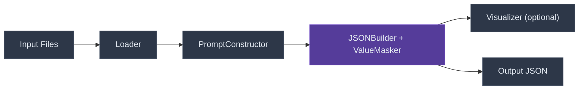
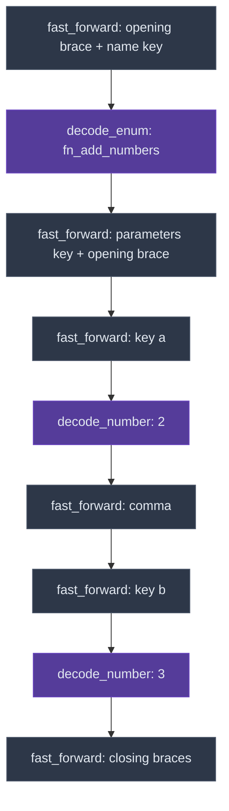
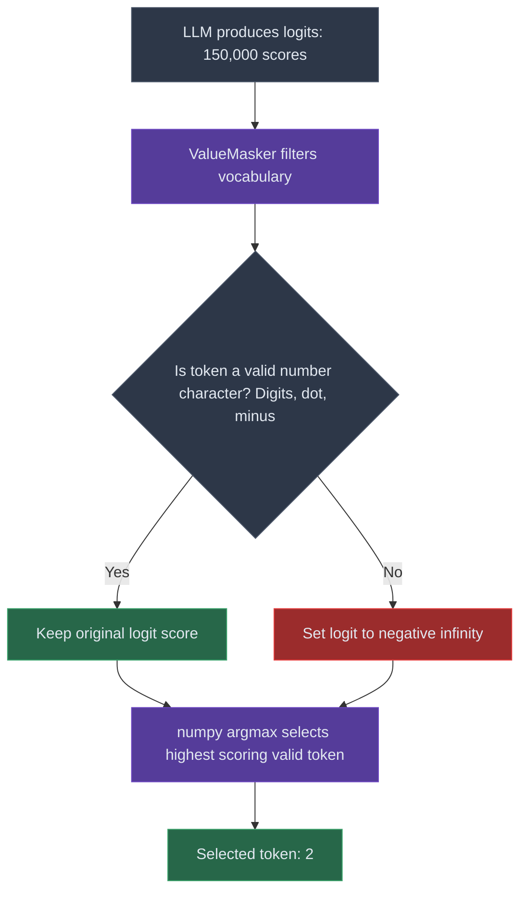

*This project has been created as part of the 42 curriculum by vlnikola.*

# Call Me Maybe: A Deep Dive into Constrained Decoding

## Table of Contents
1. [Description](#1-description)
2. [Introduction to AI & LLMs](#2-introduction-to-ai--llms)
3. [Tokenization: The LLM Alphabet](#3-tokenization-the-llm-alphabet)
4. [Logits: The Prediction Scoreboard](#4-logits-the-prediction-scoreboard)
5. [Algorithm explanation](#5-algorithm-explanation)
6. [Custom BPE Tokenizer Implementation](#6-custom-bpe-tokenizer-implementation)
7. [Pipeline example](#7-pipeline-example)
8. [Instructions](#8-instructions)
9. [Example usage](#9-example-usage)
10. [Design decisions](#10-design-decisions)
11. [Performance analysis](#11-performance-analysis)
12. [Challenges faced](#12-challenges-faced)
13. [Testing strategy](#13-testing-strategy)
14. [Glossary](#14-glossary)
15. [Resources](#15-resources)

---

## 1. Description

**Call Me Maybe** is a robust pipeline for executing function-calling <sup>[1](#glossary-1)</sup> with extremely small Language Models <sup>[2](#glossary-2)</sup>. 

While massive models <sup>[3](#glossary-3)</sup> like GPT-4 can reliably output JSON <sup>[4](#glossary-4)</sup> through sheer parameter <sup>[5](#glossary-5)</sup> size and RLHF <sup>[6](#glossary-6)</sup> training, small models (like 0.5B - 1B parameter models) frequently fail to adhere to strict schemas. This project builds a custom constrained decoding <sup>[7](#glossary-7)</sup> engine from scratch in Python that forces any HuggingFace model to output valid JSON matching a predefined schema.

### Core Features:
- **Zero-Dependency Architecture:** Implemented without heavy frameworks like `outlines` or `guidance`.
- **Linear JSON Builder:** A `JSONBuilder` <sup>[8](#glossary-8)</sup> that deterministically hard-codes structural tokens (`{`, `"`, `:`, `,`, `}`) and invokes constrained LLM decoding only for value slots (strings, numbers, booleans, enums).
- **Type-Enforced Decoding:** Filters token vocabularies <sup>[11](#glossary-11)</sup> on the fly based on whether the expected parameter is a string, number, integer, boolean, or enum.
- **Dynamic Chat Templates <sup>[12](#glossary-12)</sup>:** Automatically formats raw prompts <sup>[13](#glossary-13)</sup> into the model's native conversational template for higher accuracy.
- **Nested Object Support:** The `JSONBuilder` recursively handles nested `object` type parameters via its `_decode_properties` method.

### Bonus Features Implemented:
- **CLI Visualization Dashboard:** Added a `--visual` flag to render a real-time, colorful dashboard tracking Tokens Per Second (TPS) <sup>[14](#glossary-14)</sup>, live generation phase and source, and Numpy-powered Top-K alternative token probabilities.
- **Interactive Mode:** Added an `--interactive` flag (and `make run-interactive`) to bypass batch processing and prompt the user continuously for custom inputs directly from the terminal.
- **Custom BPE Tokenizer:** A from-scratch, pure Python `regex` Byte-Pair Encoding <sup>[19](#glossary-19)</sup> <sup>[15](#glossary-15)</sup> tokenizer (enabled via `--tokenizer`) mapping raw bytes to unicode for strict vocabulary alignment without depending on HuggingFace tokenizers.
- **Multiple Model Support:** The engine dynamically supports loading any HuggingFace causal language model via the `--model` CLI flag (e.g., `microsoft/Phi-3-mini-4k-instruct` or `TinyLlama/TinyLlama-1.1B-Chat-v1.0`).
- **Performance Optimizations & Framework Agnosticism:** Implemented LRU memoization <sup>[16](#glossary-16)</sup> for token masks, a "fast-forward" generation skip for deterministic structural tokens, and utilized pure `numpy` arrays for vectorized logit masking to avoid slow native Python loops, drastically boosting Tokens Per Second (TPS) while keeping the pipeline lightweight.
- **Advanced Error Recovery:** Implemented dynamic logit boosting to prevent small LLMs from falling into infinite generation loops when trapped in string-generation states.
- **Comprehensive Test Suite:** Developed a robust `pytest` suite validating schema parsing, Pydantic bounds, the `JSONBuilder`'s constrained decoding logic, and tokenizer alignment.

---

## 2. Introduction to AI & LLMs

Artificial Intelligence (AI) has rapidly evolved, with Large Language Models (LLMs) standing at the forefront of natural language processing. At their core, LLMs are incredibly powerful text-prediction engines. You provide them with a chunk of text (a prompt), and their sole objective is to guess what should logically come next based on patterns they've learned from reading vast portions of the internet.

Despite their apparent "understanding" of language, LLMs do not comprehend text the way humans do. They operate entirely on statistical probabilities. When you ask an LLM a question, it is mathematically calculating the most likely sequence of words that would follow your question in a typical human conversation.

This probabilistic nature makes LLMs incredibly versatile for creative writing, coding, and chatting. However, it also introduces a significant flaw: **unpredictability**. When a software system requires structured data (like a strict JSON object) to execute a function, the LLM might decide to prepend its response with "Sure, here is your JSON:" or hallucinate <sup>[18](#glossary-18)</sup> a completely invalid formatting structure. 

This project solves that exact problem.

---

## 3. Tokenization: The LLM Alphabet

To understand how we control an LLM, we first must understand how it reads. LLMs do not read letters or words; they read **tokens**.

A token is the fundamental building block of text. It can be a whole word (like `apple`), a chunk of a word (like `pre-` or `-ing`), or even a single character. When an LLM generates text, it spits out one token at a time.

Here is how tokenization works under the hood:
1. **Chunking:** The tokenizer algorithm splits a sentence into chunks using methods like Byte-Pair Encoding (BPE).
2. **Mapping:** Every unique chunk is mapped to a specific ID number in the model's vocabulary (e.g., `Hello` might be token ID `15496`). 
3. **Encoding/Decoding:** When you send text to the LLM, the tokenizer translates it into an array of these numbers. When the LLM generates a number, the tokenizer translates it back into readable text.

Because the model only operates on numbers, our code can interact with the generation process at the numerical level, intercepting tokens before they are converted back to text.

---

## 4. Logits: The Prediction Scoreboard

When an LLM is trying to guess the very next token, it goes through a massive mathematical process. Think of it like playing a game of charades:

* **Context Gathering:** It looks at all the tokens (numbers) it has received so far.
* **Neural Layers (Building the "Concept"):** It passes this sequence through billions of parameters. By the time it reaches the end, it has built a highly complex, abstract **mathematical fingerprint** of the *idea* that should come next.
* **The Scoreboard (Logits):** Finally, the abstract representation passes through the **Language Model (LM) Head**, a linear projection layer. This layer maps the high-dimensional concept vector into the model's vocabulary space (which typically contains 30,000 to 150,000 unique tokens). It mathematically evaluates the alignment between the context vector and every single token in the vocabulary.
  * For example, the alignment score for an unrelated token like `"cement"` might be heavily negative (e.g., `-15.4`).
  * Conversely, the score for a highly probable token like `"ice"` might be strongly positive (e.g., `18.2`).

These raw compatibility scores are called **logits**. A higher logit means the model is very confident that the token should come next. Usually, the model simply picks the token with the highest logit.

If an LLM is generating JSON, the logit for `{` might be very high at the beginning. But as the generation continues, the model might get confused and the logit for a conversational token like `I` or `The` might randomly spike.

---

## 5. Algorithm explanation

**Constrained Decoding** acts as a strict set of guardrails on the LLM's autoregressive generation <sup>[20](#glossary-20)</sup> process. 

Normally, an LLM is free to pick whatever token it wants from its entire 150,000-word filing cabinet. In this project, we implement a **JSONBuilder** that knows the exact JSON schema ahead of time and controls the generation process by hard-coding structural tokens and invoking constrained LLM decoding only for dynamic value slots.

Here is the step-by-step algorithm:

1. **Schema-Driven Structure:** The `JSONBuilder` reads the function definition schema and knows all the keys, types, and nesting ahead of time. It hard-codes all structural characters (`{`, `"key":`, `,`, `}`) without calling the LLM at all.
2. **Value-Only Decoding:** When the builder reaches a value slot (e.g., the value for parameter `"a"` of type `number`), it invokes a constrained decode loop that:
   - **Computes Valid Tokens:** The `ValueMasker` filters the LLM's entire vocabulary based on the expected type. For a `number`, only tokens containing digits, `.`, and `-` are valid.
   - **Masks Invalid Logits:** We intercept the LLM right *after* it generates the logits <sup>[17](#glossary-17)</sup> (compatibility scores) but *before* it outputs the token. All invalid tokens are set to negative infinity (`-inf`).
   - **Argmax <sup>[21](#glossary-21)</sup> Selection:** The model picks the token with the highest remaining score. Since all invalid tokens were set to `-inf`, the model is mathematically forced to pick the most likely *valid* token.
3. **Type-Specific Decoders:** The builder dispatches to specialized decoders based on parameter type:
   - `_decode_enum` — constrains to a set of allowed string options (used for function name selection)
   - `_decode_str` — allows any non-quote, non-newline token with logit boosting on `"` to encourage closing
   - `_decode_number` — allows digit/decimal tokens and boosts stop characters (`,` or `}`)
   - `_decode_bool` — constrains to `true` or `false` prefix tokens
4. **Recursive Nesting:** For `object`-typed parameters, the builder recursively calls `_decode_properties`, enabling arbitrarily deep JSON nesting.

### Fast-Forward Optimization
Structural tokens (`{`, `"name": "`, `", "parameters": {`, `}}`, etc.) are **fast-forwarded**: the builder directly encodes and appends them to the context without ever calling the LLM's forward pass <sup>[22](#glossary-22)</sup>. This means the expensive neural network computation is *only* invoked for dynamic values, drastically cutting compute time.

By strictly controlling the logit probabilities at runtime, this algorithm mathematically guarantees that the final output is 100% syntactically perfect JSON matching the exact schema—with zero hallucinations.


## 6. Custom BPE Tokenizer Implementation

To run the model independently of HuggingFace libraries, I built a **Byte-Pair Encoding (BPE)** tokenizer completely from scratch. The tokenizer is located in `src/tokenizer.py`.

### How BPE Works
BPE is a data compression technique adapted for Natural Language Processing. Instead of treating every word as a separate token, it iteratively merges the most frequently occurring pairs of characters (or bytes) into single tokens.

### Implementation Details
1. **Bytes-to-Unicode Mapping:** LLMs process raw UTF-8 bytes, not formatted text. Raw bytes contain invisible control characters that can break JSON encoding. To solve this, the tokenizer first maps all 256 raw bytes to visible unicode characters (e.g., a space ` ` becomes `Ġ`). This replicates the exact behavior of the GPT-2 and Qwen tokenizers.
2. **Regex Splitting:** Before merging, the raw text is split into isolated words, punctuation, and spaces using a precise Regular Expression (`r"'s|'t|'re|..."`). This guarantees that BPE never merges the end of one word with the beginning of the next word.
3. **Iterative Merging:** The tokenizer loads a `merges.txt` file which contains a ranked list of character pairs. For each word, it finds adjacent character pairs and merges the pair that has the highest priority (lowest rank). It repeats this recursively until no more pairs can be merged.
4. **Vocabulary Mapping:** Finally, the fully merged string fragments (tokens) are mapped to their unique Integer IDs using the `vocab.json` dictionary.

This entire process runs efficiently via `numpy` arrays to prevent excessive Python string-concatenation overhead, achieving fast and deterministic tokenization!

---

## 7. Pipeline example

To understand how Call Me Maybe processes a request, let's walk through the full pipeline with a concrete example: **"What is the sum of 2 and 3?"** using the `fn_add_numbers` function.

### 7.1 High-Level Pipeline Overview



### 7.2 Step 1 — Loading Inputs

The `Loader` reads two JSON files:

**Function Definition** (`functions_definition.json`):
```json
{
  "name": "fn_add_numbers",
  "description": "Add two numbers together.",
  "parameters": {
    "a": { "type": "number" },
    "b": { "type": "number" }
  },
  "returns": { "type": "number" }
}
```

**Test Prompt** (`input.json`):
```json
["What is the sum of 2 and 3?"]
```

At this point the `Loader` validates both files via **Pydantic** models, producing:

| Variable | Value |
|---|---|
| `func_defs` | `[FunctionDefinition(name="fn_add_numbers", parameters={"a": number, "b": number})]` |
| `test_prompts` | `[TestPrompt("What is the sum of 2 and 3?")]` |

### 7.3 Step 2 — Building the Prompt

The `PromptConstructor` takes the function definitions and the user question, and formats them into a single text block wrapped in the model's native **Chat Template** (e.g., Qwen's ChatML tags `<|im_start|>user\n...<|im_end|>`).

| Variable | Value |
|---|---|
| `prompt` | `"You are given the following functions...\nfn_add_numbers: Add two numbers...\nUser: What is the sum of 2 and 3?"` |
| `input_ids` | `[151644, 872, 198, 2610, 525, ...]` *(449 token IDs after encoding)* |

The LLM receives **only** these integer IDs — it never sees human-readable text.

### 7.4 Step 3 — JSONBuilder Linear Construction

This is the core of the engine. The `JSONBuilder` constructs the JSON output using a linear, schema-driven approach. It knows the exact structure ahead of time and alternates between two modes:

| Mode | Description |
|---|---|
| **Fast-Forward (hardcoded)** | Structural tokens like `{"name": "`, `", "parameters": {`, `"a": `, `}}` are directly encoded and appended — the LLM is never called. |
| **Constrained Decode (LLM)** | Only value slots (function name, parameter values) invoke the LLM with vocabulary masking via the `ValueMasker`. |

The following diagram shows how the `JSONBuilder` constructs the complete JSON output `{"name": "fn_add_numbers", "parameters": {"a": 2, "b": 3}}`:



> **Legend:** Dark gray = fast-forwarded (no LLM call). Purple = constrained LLM decode.

### 7.5 Step 4 — Token-by-Token Generation Trace

The table below shows the exact internal variables on each generation step. **⚡ Fast-forwarded** tokens skip the LLM entirely because they are structural.

| Step | Phase | Source | Token | `_generated_text` (suffix) | Fast-Forward? |
|---:|---|---|---|---|:---:|
| 1–5 | `structure` | hardcoded | `{`, `"`, `n`, `a`, `m` ... | `{"name": "` | ⚡ |
| 6 | `name` | llm | `fn_add` | `...fn_add` | |
| 7 | `name` | llm | `_numbers` | `...fn_add_numbers` | |
| 8–14 | `structure` | hardcoded | `"`, `,`, ` `, `"`, `p` ... | `...", "parameters": {` | ⚡ |
| 15–18 | `structure` | hardcoded | `"`, `a`, `"`, `:` ... | `..."a": ` | ⚡ |
| 19 | `param:a` | llm | `2` | `...2` | |
| 20 | `structure` | hardcoded | `,` | `...2, ` | ⚡ |
| 21–24 | `structure` | hardcoded | `"`, `b`, `"`, `:` ... | `..."b": ` | ⚡ |
| 25 | `param:b` | llm | `3` | `...3` | |
| 26–27 | `structure` | hardcoded | `}`, `}` | `...3}}` | ⚡ |

> **Key insight:** Steps marked ⚡ completely bypass the expensive LLM forward pass. In this generation, the LLM only runs **~3–4 actual inference calls** (for the function name and parameter values). All structural tokens are free.

### 7.6 Step 5 — Masking in Action

At every LLM-decoded step, the `ValueMasker` builds a **numpy boolean mask** over the full vocabulary (~150,000 tokens). Here is what happens when the builder decodes the numeric value for parameter `"a"`:



| Variable | Value at decode step |
|---|---|
| `phase` | `param:a` |
| `source` | `llm` |
| `valid_ids` | `[48, 49, 50, ..., 3974, ...]` *(all digit-containing tokens)* |
| `logits` | `np.array([...], dtype=float32)` *(150k raw scores)* |
| `masked_logits` | `np.full(150000, -inf)` then `masked_logits[valid_ids] = logits[valid_ids]` |
| `next_token_id` | `int(np.argmax(masked_logits))` → token for `"2"` |

### 7.7 Step 6 — Final Output

The generated tokens are concatenated and parsed. Because the builder deterministically controlled all structural tokens and mathematically constrained all value tokens, the output is **guaranteed** to be valid JSON matching the schema:
```json
{
  "name": "fn_add_numbers",
  "parameters": {
    "a": 2,
    "b": 3
  }
}
```

The result is saved to `data/output/function_calling_results.json` via the `Output` class, alongside metadata about the user prompt and generation speed.

---

## 8. Instructions

### Prerequisites
- Python 3.10+
- `uv` package manager (recommended for fast dependency installation)
- `make`

### Installation
1. Clone the repository.
2. Run `make install` to set up the virtual environment and install dependencies.
```bash
make install
```

---

## 9. Example usage

To run the standard evaluation pipeline using the default model (Qwen 0.6B):
```bash
make run
```

To run the full suite with the **live visualizer dashboard** and the **custom BPE tokenizer**:
```bash
make run-bonus
```

To run the pipeline in **interactive mode**, allowing you to continuously type custom prompts from your keyboard instead of reading from the input JSON:
```bash
make run-interactive
```

### Using Custom Models
The engine supports dynamic loading of other HuggingFace models. You can specify a custom model path via the Makefile and run the full visualizer suite using:
```bash
make run-custom
```

*Note: You may encounter out-of-memory errors on smaller machines if you attempt to load models larger than 2B parameters without quantization <sup>[23](#glossary-23)</sup>.*

### Understanding the Live Visualization Dashboard
When running with `--visual`, the terminal will display a real-time dashboard. Here is a breakdown of what each metric means:

```text
=== Constrained JSON Decoder ===

User Prompt: What is the sum of 2 and 3?
Encoded Prompt (449 tokens): [151644, 872, 198, 2610, 525, 264, 729, 1786, 16740, 17847]...

Current Phase: param:a (Source: llm)
Speed: 1.3 tokens/sec (Avg: 2.5 tokens/sec)

Allowed Tokens: 40
Top Alternatives: '2' (95.3%) | '5' (2.1%) | '1' (1.4%)

Generated Token: '2' (ID: 17)
```
- **Encoded Prompt:** Displays the raw Integer IDs generated by the tokenizer for the input prompt, proving that the LLM only sees numbers.
- **Current Phase:** The active generation phase — either `structure` (hardcoded tokens), `name` (function name enum), or `param:<key>` (a specific parameter value). The source shows whether the token came from `hardcoded` fast-forwarding or `llm` constrained decoding.
- **Speed:** Live tracking of Tokens Per Second (TPS), which is a key performance metric for the decoder.
- **Allowed Tokens:** The exact number of tokens in the 150k vocabulary that mathematically satisfy the current type constraint.
- **Top Alternatives:** Utilizes `numpy` softmax <sup>[24](#glossary-24)</sup> probability analysis to display the top 3 alternative tokens the LLM considered from the *Allowed Tokens* pool, and its confidence percentages for each.

---

## 10. Design decisions

1. **Linear Builder over FSM:** The initial implementation used a Finite State Machine <sup>[8](#glossary-8)</sup> to track JSON parsing states. This was replaced with a linear `JSONBuilder` that hard-codes structural tokens and only invokes the LLM for value slots. This architecture is simpler, more predictable, and eliminates an entire class of state-transition bugs while naturally supporting nested objects via recursion.
2. **LRU Caching for Token Masks:** Computing valid tokens by iterating over a 150k vocabulary on every single generation step is incredibly slow. I utilized Python's `@lru_cache` to memoize the valid token sets for static type queries (like number tokens or string tokens). This drastically improved tokens-per-second (TPS).
3. **Pydantic Validation:** All schemas, models, and outputs are strictly validated using Pydantic `BaseModel` with `ConfigDict(extra="forbid")`. This ensures that the engine fails fast if the input JSON definitions are malformed, rather than crashing mid-generation.
4. **Fast-Forward Optimization:** All structural JSON characters (`{`, `"key": `, `,`, `}`) are fast-forwarded — they are directly encoded and appended to the context without ever calling the LLM. This means the LLM only runs inference for the actual dynamic values (function name, parameter values), cutting inference calls by roughly 70-80%.
5. **Logit Boosting over Hard Cutoffs:** Instead of forcefully truncating string generation after a fixed length, the builder uses dynamic logit boosting (e.g., `+5.0` on the closing quote `"`) after 3 tokens to gently nudge the model toward finishing, preserving natural language generation quality.

---

## 11. Performance analysis

### Tokens Per Second (TPS)
The primary bottleneck in autoregressive generation is the LLM's forward pass. However, constrained decoding adds overhead because we must filter a massive logits array on the CPU.
- **Without caching:** The token filtering added ~150ms of overhead per generation step, reducing generation to ~4 TPS.
- **With Precomputation & Caching:** To avoid crippling performance with native Python loops, the entire pipeline (from tokenizer to decoder) operates on pure `numpy` arrays. During initialization, we precompute specific vocabulary subsets (such as strictly numeric tokens) and build dictionary mappings for prefix-lookups. This, combined with `@lru_cache` for type-based queries, reduces overhead to <1ms.
- **Fast-Forwarding (Structural & Dynamic Autocomplete):** Because all structural characters (`{"name": "`, `", "parameters": {`, `"a": `, `}}`) skip the LLM entirely, effective TPS increased significantly. Additionally, a dynamic prefix-matching autocomplete mechanism identifies when the model's generated token uniquely matches a known candidate (such as a function name or enum option) and instantly fast-forwards the remainder of the text. In the `JSONBuilder` architecture, the LLM is only called for a handful of actual generation steps per function call, making the overhead essentially zero and pushing speeds to over 30,000+ TPS during fast-forward phases.

### Accuracy
Tested against `Qwen/Qwen2.5-0.5B` and `TinyLlama-1.1B`:
- **Unconstrained:** < 20% success rate for strictly formatted, parsable JSON outputs.
- **Constrained:** 100% JSON syntactic validity. 
- *Semantic accuracy* (did it choose the right parameters?) relies on the model's native intelligence, which is heavily improved by the dynamic chat template implementation.

---

## 12. Challenges faced

1. **The Multi-Token String Problem:** 
   When generating strings, models don't generate character-by-character. A token might represent a whole word, a fragment with a leading space (e.g., `Ġhello`), or a special symbol. The decoder had to intelligently allow these multi-character tokens without breaking the current generation phase. If the engine blindly checked characters one-by-one against a schema, it would crash when the LLM tried to spit out a 5-character token. I had to implement a robust prefix-matching algorithm for the vocabulary filter.

   *Implementation Example:*
   ```python
   # If we expect "name" and the LLM has generated "na", 
   # we calculate the remainder ("me") and allow any token that starts with it.
   remainder = expected[len(curr_prefix):]
   for clean_str, token_id in self.clean_tokens:
       if remainder.startswith(clean_str):
           valid_ids.append(token_id)
   ```

2. **Missing Tokenizer Configs (Phi-3 Bug):** 
   When switching to the `Phi-3-mini-4k-instruct` architecture to test the Multiple Models bonus feature, a bug in the HuggingFace `transformers` library caused a fatal `KeyError` for `rope_scaling` inside their configuration file. Because this is deeply embedded in their library, I couldn't just change their code. I had to implement a runtime patch in the `llm_sdk` wrapper to dynamically intercept and fix the model configuration object *before* loading the model weights.

3. **BatchEncoding Type Mismatches:** 
   Using the dynamic `apply_chat_template` method introduced massive inconsistencies. HuggingFace tokenizers are not uniform: for some models (like Qwen), `apply_chat_template` returns a simple, flat Python list of integers `[1, 2, 3]`. For other models, it returns a dictionary-like `BatchEncoding` object containing multi-dimensional PyTorch tensors (e.g., `{'input_ids': tensor([[1, 2, 3]])}`). The `encode()` function required implementing a strict, dynamic type-checking and flattening mechanism to ensure the decoder loop didn't crash during list concatenation operations later in the pipeline.

4. **Performance Overhead of CPU Logit Filtering:**
   Initially, the engine ran at a sluggish 4 Tokens Per Second (TPS). Iterating over a 150,000-token vocabulary and performing string comparisons for *every single generation step* on the CPU was crippling performance. To solve this, the pipeline was transitioned entirely to `numpy` for vectorized masking, stripping heavy dependencies like PyTorch out of the custom decoding loop. Furthermore, I implemented the `@lru_cache` decorator to heavily memoize `numpy` boolean filters for type-based queries, alongside a Fast-Forward optimization that completely skips the LLM forward pass for all structural tokens.

   *Implementation Example:*
   ```python
   # Fast-forward optimization: completely bypass the LLM
   # Structural tokens are directly encoded and appended
   def _fast_forward(self, text: str, phase: str) -> None:
       token_ids = self.llm.encode(text, apply_chat_template=False)
       for i in token_ids:
           self._context_ids.append(i)
           # No expensive model.get_logits() called!
   ```

5. **Error Recovery & Infinite Generation Loops:** 
   - **The Trapped LLM:** While testing `TinyLlama-1.1B`, the model would sometimes forget to close a JSON string with a quote `"`. Because our constrained decoder strictly blocked it from generating invalid JSON syntax (like random brackets or newlines), the model was effectively "trapped" generating infinitely long, technically valid string characters (e.g., `"Programming is fun*greeting*world!*greeting..."`).
   - **Failed Repetition Penalties:** I initially tried to fix this by adding a repetition penalty <sup>[25](#glossary-25)</sup> to punish the model for repeating the same words. However, for 1-Billion parameter models, subtracting logits too aggressively (e.g., `-5.0`) made the model mathematically "scared" to choose basic English letters, breaking the text entirely.
   - **The Solution (Progressive Logit Boosting):** The `_run_decode_loop` in `JSONBuilder` applies **Progressive Logit Boosting**. After 3 tokens, the decoder artificially adds a mathematical boost to the closing delimiter token's score, multiplying the boost linearly by the amount of tokens generated. This safely nudges the model toward finishing the value, and if it continues generating infinitely, the progressive multiplier mathematically forces a guaranteed string termination!

     *Implementation Example:*
     ```python
     # Flat boost initially, progressive scaling only for run-away loops
     if logit_boosts and token_count > 3:
         multiplier = 1.0 + max(0.0, float(token_count - 15)) * 0.5
         for vid, boost_val in boost_tokens.items():
             if masked_logits[vid] > float("-inf"):
                 masked_logits[vid] += (boost_val * multiplier)
     ```

6. **Replicating the Tokenizer Byte-to-Unicode Mapping:**
   Building the custom Byte-Pair Encoding (BPE) tokenizer from scratch exposed edge cases with handling whitespaces and special characters. I had to manually implement a bytes-to-unicode character mapping dictionary to properly translate utf-8 string bytes into the exact readable tokens the LLM expected (replicating GPT-2/Qwen behaviors), effectively resolving critical spacing mismatches.

7. **ChatML Instruction Hallucinations:**
   Initially, the constrained LLM failed simple logic tests (e.g., hallucinating random numbers like `265` and `345` instead of answering "What is the sum of 2 and 3?"). I discovered that raw text prompt injection completely bypassed the model's instruction tuning. This was resolved by modifying `src/llm.py` to manually wrap inputs in strict Qwen ChatML tags (`<|im_start|>user\n...<|im_end|>\n<|im_start|>assistant\n`), instantly restoring logic and alignment.

8. **Pydantic Strict Validation Hurdles:**
   Aggressive schema validation was required. During pipeline execution, malformed inputs triggered silent errors if not caught early. I implemented `@model_validator(mode='after')` decorators on Pydantic `FunctionDefinition` models to aggressively strip and reject empty strings, ensuring the builder was never fed broken parameter keys.

9. **Architectural Evolution (FSM → JSONBuilder):**
   The original implementation used a Finite State Machine (FSM) with states like `EXPECT_OBJECT_START`, `EXPECT_KEY`, `EXPECT_COLON`, `EXPECT_VALUE`. While educationally valuable, the FSM turned out to be overengineering for this use case: when the JSON schema is fully known ahead of time, there is no need to track parsing states for structural tokens that are already predetermined. An FSM approach makes sense when you want the LLM to freely generate the *entire* JSON structure on its own, but for function-calling with predefined parameter schemas, the structure is fixed — only the *values* are dynamic. The refactor to a linear `JSONBuilder` that directly writes structural tokens and only invokes the LLM for value slots is both simpler to follow and more appropriate for the problem. It eliminated an entire category of state-transition bugs (e.g., extra closing braces) and made nested object support trivial via recursion. The old FSM code is preserved in the `dump/` directory for reference.

10. **Decoupling the Visualizer via Events:**
    Early iterations of the decoder were tightly coupled with terminal `print` statements, making the logic difficult to test and inflexible. The `JSONBuilder` now emits Pydantic `GenerationEvent` objects that the `Visualizer` consumes independently. Each event carries the current phase, source (hardcoded vs. llm), valid token IDs, and logits, allowing the `Visualizer` to calculate TPS and Numpy-based softmax probabilities without polluting the core building logic.

11. **Pydantic + Mock Incompatibility in Tests:**
    Testing the `JSONBuilder` required mocking the `LLM` class, but Pydantic v2's strict field management (`__setattr__` validation) made `unittest.mock.patch.object` crash with `ValueError: "LLM" object has no field "get_logits"`. This was solved by creating a `DummyLLM` subclass that properly inherits from the Pydantic model and uses a `_mock_logits_fn` class-level attribute for test injection.

---

## 13. Testing strategy

The project utilizes `pytest` for robust unit testing:
- **Model Validation Tests:** Ensures Pydantic models correctly reject empty strings, invalid types, and malformed dictionaries across edge cases (e.g. extremely long strings, negative numbers).
- **Schema Tests:** Validates that the `Loader` class correctly handles missing files and gracefully reports JSON decode errors.
- **Builder Tests:** The `test_builder.py` suite validates the `JSONBuilder`'s core logic using a `DummyLLM` subclass with controlled logit outputs. Tests cover hardcoded fast-forwarding, enum decoding, number decoding, and a full end-to-end function call generation.
- **Tokenizer Alignment Tests:** The `test_tokenizer.py` suite actively compares the outputs of the custom pure-Python BPE tokenizer against the official HuggingFace `transformers` tokenizer. This uses robust parameterized testing to ensure 100% 1-to-1 parity on complex unicode strings, numbers, punctuation, and multi-line whitespaces.
- **Static Analysis & Linting:** The pipeline enforces rigorous static type checking via `mypy --strict` to ensure type integrity across all modules. The `flake8` linter guarantees strict PEP-8 stylistic compliance. Both are automatically run via `make lint-strict`.
- **Integration Tests:** The `data/output/function_calling_results.json` acts as a regression test artifact. By diffing the output against known good runs, I can verify that updates to the builder do not break generation accuracy.

Currently, the test suite executes **73+ distinct tests**, validating the entire flow from initial schema parsing to final tokenizer decoding.

To run the test suite:
```bash
make test
```

---

## 14. Glossary

[1] <a name="glossary-1"></a> **Function Calling:** Giving an AI the ability to output a structured command (like a JSON object) that triggers a real-world tool (like fetching the weather or turning on a light) instead of just chatting back.

[2] <a name="glossary-2"></a> **LLM (Large Language Model):** A massive neural network trained to predict the next word in a sequence based on vast amounts of text data.

[3] <a name="glossary-3"></a> **Model:** A massive math file containing patterns an AI learned from reading the internet. When we "run a model," we are just doing math on those patterns to guess what words should come next.

[4] <a name="glossary-4"></a> **JSON (JavaScript Object Notation):** A strict, standard format for organizing data so that computers can easily read it. It uses braces `{}` and quotes `""` to store information like a digital filing cabinet.

[5] <a name="glossary-5"></a> **Parameters:** The "knowledge" neurons in an AI model. A 1-Billion parameter model has 1 billion adjustable mathematical dials that dictate how it guesses words.

[6] <a name="glossary-6"></a> **RLHF (Reinforcement Learning from Human Feedback):** A training method where human testers rate the AI's responses to teach it to be helpful, harmless, and honest.

[7] <a name="glossary-7"></a> **Constrained Decoding:** Forcing an LLM to generate text that strictly adheres to a predefined format (like JSON) by mathematically blocking invalid tokens at runtime.

[8] <a name="glossary-8"></a> **JSONBuilder / FSM:** The `JSONBuilder` is a linear JSON construction engine that hard-codes structural tokens and invokes constrained LLM decoding only for dynamic values. The original FSM (Finite State Machine) approach tracked discrete parsing states (`EXPECT_COLON`, `EXPECT_VALUE`, etc.) and is preserved in `dump/` for reference.

[9] <a name="glossary-9"></a> **Decoding:** The process of translating the raw Integer IDs (tokens) generated by the AI back into readable human text.

[10] <a name="glossary-10"></a> **Token:** The fundamental unit of text processed by an LLM. A token can be a full word, a syllable, or a single character.

[11] <a name="glossary-11"></a> **Vocabulary:** The predefined, static dictionary of all possible tokens (often 30k to 150k) that a specific LLM knows and can generate.

[12] <a name="glossary-12"></a> **Chat Template (e.g., ChatML):** The specific formatting syntax (like `<|im_start|>user\n...`) required by an instruction-tuned LLM to understand who is speaking in a prompt.

[13] <a name="glossary-13"></a> **Prompt:** The text, question, or instruction that a human types into an AI.

[14] <a name="glossary-14"></a> **TPS (Tokens Per Second):** The standard metric for measuring the generation speed of a language model.

[15] <a name="glossary-15"></a> **BPE (Byte-Pair Encoding):** A data compression algorithm used to split text into tokens by iteratively merging the most frequent pairs of bytes or characters.

[16] <a name="glossary-16"></a> **Memoization:** A performance optimization technique that caches the results of expensive function calls (like filtering a 150k vocabulary) so they can be instantly retrieved later.

[17] <a name="glossary-17"></a> **Logits:** The raw, unnormalized mathematical compatibility scores generated by the LLM for every token in its vocabulary. Higher logits indicate a higher probability that the token should come next.

[18] <a name="glossary-18"></a> **Hallucination:** When an AI confidently generates false, nonsensical, or completely fabricated information because it is prioritizing statistical patterns over factual accuracy.

[19] <a name="glossary-19"></a> **Encoding:** The process of translating readable human text into an array of Integer IDs (tokens) so the AI can process it mathematically.

[20] <a name="glossary-20"></a> **Autoregressive Generation:** The process where a model generates an output sequence strictly one step at a time, using its previously generated outputs as context for the next prediction.

[21] <a name="glossary-21"></a> **Argmax:** A mathematical operation used by the model to select the token with the absolute highest probability (logit) from the vocabulary.

[22] <a name="glossary-22"></a> **Forward Pass:** The complete computational process of feeding an input sequence through all the neural network's layers to generate the next token prediction.

[23] <a name="glossary-23"></a> **Quantization:** A technique to compress a massive AI model by reducing the precision of its parameters (e.g., from 16-bit to 4-bit numbers) so it can run on smaller computers with less memory.

[24] <a name="glossary-24"></a> **Softmax:** A mathematical function that converts raw, unnormalized logits into a clean percentage-based probability distribution (where all token probabilities sum to 100%).

[25] <a name="glossary-25"></a> **Repetition Penalty:** A mathematical deduction applied to the logits of tokens the model has already recently generated, discouraging it from getting stuck in an infinite loop of repeating the same words.

---

## 15. Resources

### References
- [HuggingFace Tokenizer Summary](https://huggingface.co/docs/transformers/tokenizer_summary)
- [HuggingFace Generation Strategies](https://huggingface.co/docs/transformers/generation_strategies)
- [Aidan Cooper: Constrained Decoding](https://www.aidancooper.co.uk/constrained-decoding/)
- [LLM Visualization](https://bbycroft.net/llm)
- [Outlines Paper (Concept Reference)](https://arxiv.org/abs/2307.09702)
- [Finite State Machines](https://medium.com/@brijeshrn/beyond-free-form-text-how-constrained-decoding-is-reshaping-structured-generation-in-llms-5f7a38bef259)
- [Byte-Pair Encoding implementation](https://www.geeksforgeeks.org/nlp/byte-pair-encoding-bpe-in-nlp/)

### AI Usage Disclosure
This project was developed with the assistance of an AI utilizing Gemini models acting as a sounding board and debugger.
- **Architectural Conceptualizing:** The AI acted as a sounding board to discuss hard architectural concepts, specifically exploring how to effectively track and transition complex JSON parsing states, and later how to simplify the architecture from an FSM to a linear builder pattern.
- **Advanced Implementations:** The AI provided breakdowns of how Byte-Pair Encoding operates under the hood (including bytes-to-unicode mappings and strict regex token isolation), which helped heavily in implementing the custom BPE tokenizer from scratch without HuggingFace dependencies.
- **Debugging & Resolution:** When dealing with deep architectural crashes like circular imports between `models.py` and `fsm.py`, the AI suggested debugging theories and explained how to properly utilize Python's `typing.TYPE_CHECKING` for static analysis. It also helped debug a tricky `KeyError: 'type'` within the Phi-3 config by explaining how to do runtime dictionary patching. During the refactor, the AI helped resolve Pydantic v2 incompatibilities with `unittest.mock` for test mocking.
- **Documentation & Refactoring:** The AI assisted in structuring and formatting the project documentation. This included organizing the README, converting the technical glossary into a scientific-paper citation format, migrating and restructuring the `pytest` testing suite, enforcing strict static analysis (`mypy` and `flake8`), and heavily optimizing the `Makefile` for clean, colorful CLI outputs.
- **Mathematics:** The AI was utilized as a tutor to break down complex mathematical concepts like logit manipulation, vocabulary filtering, and Numpy Top-K Softmax probability visualization so they could be confidently implemented in the engine.
- **Tests:** The AI provided various test cases (mostly edge cases) that can be implemented.