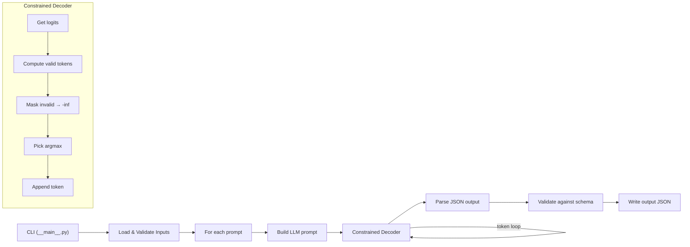

# Call Me Maybe — Study Guide & Project Plan

> Covers **mandatory** + **bonus** parts from `call_me_maybe_subj.pdf`

---

## Part 1: What to Study (in order)

Study these topics **before** you start coding. Each builds on the previous one.

### 1. Tokenization & Vocabulary Files
> [!IMPORTANT]
> This is the foundation — everything else depends on understanding how text ↔ token IDs work.

- **What to learn:**
  - What BPE (Byte-Pair Encoding) and SentencePiece tokenization are
  - How a vocab file maps token IDs → string tokens (e.g., `{"42": "Ġhello"}`)
  - The `Ġ` prefix convention (represents a leading space)
  - Difference between `encode(text) → [int]` and `decode([int]) → text`
- **Resources:**
  - [HuggingFace Tokenizer Summary](https://huggingface.co/docs/transformers/tokenizer_summary)
  - [Karpathy's "Let's build GPT" tokenizer section](https://www.youtube.com/watch?v=kCc8FmEb1nY) (first 30 min)
  - Inspect the vocab file: load it as JSON, search for tokens like `{`, `"`, digits

### 2. LLM Inference Basics (Autoregressive Generation)
- **What to learn:**
  - How an LLM generates text **one token at a time**
  - The loop: `prompt → tokenize → model → logits → pick token → append → repeat`
  - What **logits** are (raw scores before softmax; higher = more likely)
  - Greedy decoding (pick argmax) vs. sampling
  - What an **EOS token** is and when to stop
- **Resources:**
  - [Jay Alammar — The Illustrated Transformer](https://jalammar.github.io/illustrated-transformer/)
  - [HuggingFace Generation Docs](https://huggingface.co/docs/transformers/generation_strategies)

### 3. Constrained Decoding ⭐
> [!IMPORTANT]
> This is the **core skill** the project tests. You won't pass without deeply understanding this.

- **What to learn:**
  - The idea: at each generation step, **mask invalid tokens** by setting their logits to `-inf`
  - How to track **parser state** (e.g., "I'm inside a JSON string" vs. "expecting a key")
  - How to determine which tokens are **valid** at each state
  - Using the vocab file to map token strings → IDs and filter logits accordingly
  - Why this guarantees 100% valid JSON even from a tiny 0.6B model
- **How it works step by step:**
  1. Model produces logits for all ~150k tokens
  2. You check current JSON parser state (expecting `{`, `"`, digit, `}`, etc.)
  3. You find all token IDs whose string would be valid at this position
  4. Set all other logits to `-inf`
  5. Pick the highest remaining logit → that's your next token
  6. Update parser state, repeat
- **Resources:**
  - [Outlines paper](https://arxiv.org/abs/2307.09702) — read the approach, but **do not use the library** (forbidden!)
  - [LMQL paper](https://arxiv.org/abs/2212.06094) — another constrained decoding approach
  - Think of it as building a **JSON state machine** that filters tokens

### 4. JSON Schema & Type Validation
- **What to learn:**
  - The structure of `functions_definition.json` (name, description, parameters with types, returns)
  - JSON types: `number`, `integer`, `string`, `boolean`
  - How to constrain the decoder to **only produce valid values** for each type:
    - `number` → digits, `.`, `-`, `e`
    - `integer` → digits, `-`
    - `string` → any characters between `""`
    - `boolean` → only `true` or `false`
  - How to constrain the `name` field to only produce one of the function names from the definitions

### 5. The `llm_sdk` API
- **What to learn** (only public methods allowed!):
  - `Small_LLM_Model` — the main class
  - `get_logits_from_input_ids(input_ids: List[int]) → List[float]` — core inference
  - `get_path_to_vocab_file() → str` — get the vocab JSON path
  - `encode(text: str) → Tensor` — text to token IDs
  - `decode(token_ids: List[int]) → str` — token IDs to text (optional)
- **Action item:** Copy `llm_sdk/` into your project root (next to `src/`), open the source, and read every public method

### 6. Pydantic Models
- **What to learn:**
  - Pydantic `BaseModel` for data validation
  - Defining models for: function definitions, test prompts, output results
  - Field validators, type coercion
- **Why:** The subject says "All classes must use pydantic for validation"

### 7. Python Project Structure & Tooling
- **What to learn:**
  - `python -m src` and `__main__.py` / `__init__.py`
  - `argparse` for CLI arguments
  - `flake8` + `mypy` flags and how to pass lint checks
  - PEP 257 docstrings (Google style)

---

## Part 2: Implementation Plan

### Architecture Overview



### Phase 0: Project Setup
- [x] Makefile with uv targets
- [x] `pyproject.toml` with dependencies
- [ ] Copy `llm_sdk/` into project root
- [ ] Create proper `src/__main__.py` with `argparse`
- [ ] Create `.gitignore` (exclude `.venv/`, `__pycache__/`, `data/output/`)
- [ ] Verify `uv sync` + `uv run python -m src --help` works

### Phase 1: Pydantic Models (`src/models.py`)
Define data models for everything:
```python
class FunctionParameter(BaseModel):
    type: str  # "number", "integer", "string", "boolean"

class FunctionDefinition(BaseModel):
    name: str
    description: str
    parameters: dict[str, FunctionParameter]
    returns: FunctionParameter

class TestPrompt(BaseModel):
    prompt: str

class FunctionCallResult(BaseModel):
    prompt: str
    name: str
    parameters: dict[str, Any]
```

### Phase 2: Input Loading & Validation (`src/loader.py`)
- Load `functions_definition.json` → `list[FunctionDefinition]`
- Load `function_calling_tests.json` → `list[TestPrompt]`
- Handle: missing files, invalid JSON, schema mismatches
- All errors → clear messages, no crashes

### Phase 3: LLM Wrapper (`src/llm.py`)
- Initialize `Small_LLM_Model`
- Load and parse the vocabulary file (`get_path_to_vocab_file()`)
- Build a **reverse vocab mapping**: `token_string → token_id`
- Helper methods:
  - `encode_prompt(text: str) → list[int]`
  - `get_next_logits(input_ids: list[int]) → list[float]`

### Phase 4: Constrained Decoder (`src/decoder.py`) ⭐ THE CORE
> [!IMPORTANT]
> This is where 80% of your effort goes. Get this right and the project works.

**JSON State Machine** — track where you are in the output JSON:
```
States:
  OBJECT_START       → expecting `{`
  KEY_NAME           → expecting `"name"` or `"parameters"`
  COLON              → expecting `:`
  VALUE_STRING       → expecting `"fn_xxx"`
  VALUE_NUMBER       → expecting digits/float
  VALUE_INTEGER      → expecting digits only
  VALUE_BOOLEAN      → expecting `true`/`false`
  OBJECT_END         → expecting `}` or `,`
  ...
```

**For each state**, compute valid token IDs:
1. Look at what characters/strings are valid at this position
2. Find all vocab tokens that match (prefix-match for multi-char tokens)
3. Build a mask, set invalid logits to `-inf`
4. Pick argmax from remaining logits

**Key implementation decisions:**
- The `name` field is constrained to only valid function names from the definitions
- Parameter keys are constrained to the exact keys from the function definition
- Parameter values are constrained by their type
- You need to handle multi-character tokens carefully (a token might be `": "` which spans a colon and value)

### Phase 5: Prompt Engineering (`src/prompt.py`)
- Build a dedicated prompt-construction module whose only job is to turn validated inputs into a single deterministic LLM prompt string.
- Keep the module pure: no file I/O, no model loading, no decoding logic, and no direct dependency on the CLI.
- Treat the prompt as a contract between the loader, the LLM, and the constrained decoder. The prompt should help the model choose the right function, while the decoder still enforces correctness.

#### 5.1 Purpose of `src/prompt.py`
- Give the model enough context to identify which function should be called for the current user request.
- Present the available functions in a stable, readable, machine-friendly way.
- Minimize ambiguity by explicitly describing the output shape the model must follow.
- Keep prompt generation deterministic so the same inputs always produce the same prompt text, which makes debugging and testing easier.

#### 5.2 Inputs and Outputs
- **Input:** a list of validated `FunctionDefinition` objects and one validated user prompt string.
- **Output:** one formatted prompt string ready to be tokenized and passed into `ConstrainedDecoder.generate()`.
- The module should not mutate the input models. It should only read from them and build text.
- If the input list of functions is empty, the builder should fail fast with a descriptive error because the model cannot make a meaningful function choice.

#### 5.3 Prompt Structure
- Use a fixed section order so the model sees the same organization every time.
- Recommended structure:
  - system/instruction block: explain that the model must return a function-call JSON object only
  - function catalog block: list every available function with description, parameters, and return type
  - output contract block: restate the required JSON shape and type expectations
  - user request block: include the actual user prompt last so it remains the freshest context
- Keep headers explicit and unambiguous, such as `Available functions:`, `Output format:`, and `User request:`.
- Avoid natural-language clutter that does not add selection signal, because the decoder already guarantees structure and the prompt only needs to help with function choice.

#### 5.4 Function Serialization Rules
- Serialize each function in a consistent format.
- Include the function name exactly as it appears in the JSON input.
- Include the function description in full unless it is extremely long; if truncation is ever needed, define a deterministic truncation rule.
- List parameters in a stable order. Use the original order from the JSON file or alphabetical order, but choose one rule and keep it fixed.
- For each parameter, show both the name and the type.
- Include the return type so the model has a stronger semantic hint about what the function does.
- Separate functions clearly with blank lines or bullets, but keep the formatting compact enough that the prompt does not become unnecessarily long.

#### 5.5 Output Contract Text
- The prompt should explicitly tell the model what the final JSON must contain.
- Reinforce that only the function call structure is allowed, not freeform explanation text.
- The contract should mention the top-level keys expected by the decoder, especially `name` and `parameters`.
- Make it clear that the function name must be chosen from the provided catalog and that parameter keys must match the selected function definition.
- The prompt should not try to encode the entire JSON grammar. That is the decoder's job. It only needs to orient the model toward the correct structure.

#### 5.6 Helper Functions to Implement
- `format_function_definition(definition) -> str`: serialize one `FunctionDefinition` into a readable text block.
- `format_parameter(name, parameter) -> str`: serialize one parameter entry with its type.
- `format_function_catalog(definitions) -> str`: serialize the whole function list in deterministic order.
- `build_prompt(function_definitions, user_prompt) -> str`: assemble the final prompt string from all sections.
- Optional helper: `normalize_text(value) -> str` to strip redundant whitespace before insertion into the prompt.

#### 5.7 Validation and Safety Checks
- Reject a blank or whitespace-only user prompt if that would create a meaningless generation request.
- Reject an empty function catalog.
- Preserve special characters safely when inserting descriptions or user prompts into the text.
- Do not rely on implicit formatting side effects; all section separators and indentation should be explicit.
- Keep the builder stable across Python versions and locale settings by avoiding any formatting that depends on environment-specific behavior.

#### 5.8 Integration Points
- `src/__main__.py` should call the prompt builder once per test prompt.
- `src/decoder.py` should receive the built prompt string exactly as returned, with no extra transformation beyond tokenization.
- `src/models.py` already defines the input types, so prompt.py should type against those models rather than raw dictionaries.
- `src/loader.py` remains responsible for validation of the JSON files; prompt.py should assume it receives already-validated objects.

#### 5.9 Testing Strategy for `src/prompt.py`
- Verify deterministic output: the same inputs should always produce identical prompt text.
- Verify coverage: every function from the catalog should appear once in the generated prompt.
- Verify content: function names, parameter names, parameter types, and return types should all be present.
- Verify structure: the output should contain the expected section headers in the expected order.
- Verify error handling: empty function lists and invalid prompt strings should raise clear exceptions.
- Verify edge cases: long descriptions, many functions, special characters, and unusual whitespace in the user prompt.

#### 5.10 Why This Module Matters
- Better prompts improve the model's function selection accuracy before decoding begins.
- A clean separation keeps the prompt logic easy to test without involving the model.
- Deterministic prompt text makes it easier to diff outputs and debug failures.
- Prompt quality and decoder correctness work together: prompt.py helps the model choose well, and decoder.py guarantees the output remains valid JSON.

### Phase 6: Main Pipeline (`src/__main__.py`)
```python
1. Parse CLI args (--functions_definition, --input, --output)
2. Load function definitions + test prompts
3. Initialize LLM + decoder
4. For each prompt:
   a. Build LLM prompt with function context
   b. Run constrained decoding → get JSON string
   c. Parse JSON → FunctionCallResult
   d. Append to results
5. Write results to output JSON file
```

### Phase 7: Output & Validation (`src/output.py`)
- Write `list[FunctionCallResult]` to JSON file
- Validate: all required keys present, types match definitions
- Create output directory if it doesn't exist

### Phase 8: Polish & Compliance
- [ ] All functions have type hints
- [ ] All functions/classes have PEP 257 docstrings
- [ ] `make lint` passes (flake8 + mypy)
- [ ] `make lint-strict` passes
- [ ] Graceful error handling everywhere
- [ ] Test with edge cases: empty strings, large numbers, special characters

### Phase 9: README.md
Required sections:
- [ ] Opening line: `*This project has been created as part of the 42 curriculum by vlnikola.*`
- [ ] Description
- [ ] Instructions (install, run, examples)
- [ ] Algorithm explanation (constrained decoding)
- [ ] Design decisions
- [ ] Performance analysis
- [ ] Challenges faced
- [ ] Testing strategy
- [ ] Resources + AI usage disclosure

---

### Phase 10: Bonus Features

| Bonus | Difficulty | What to do |
|-------|-----------|------------|
| Multiple LLM models | 🟢 Easy | Add a `--model` CLI flag, init different models |
| Recode tokenizer (encode/decode) | 🔴 Hard | Build your own `encode()` using vocab file + BPE merge rules, avoid calling `model.encode()` |
| Advanced error recovery | 🟡 Medium | Retry failed generations, fallback strategies, graceful degradation |
| Performance optimizations | 🟡 Medium | Cache logits, precompute valid token masks per state, batch processing |
| Comprehensive test suite | 🟢 Easy | pytest tests for models, loader, decoder, edge cases |
| Visualization of generation | 🟡 Medium | Print/log each token as it's generated, show masked tokens, probabilities |
| Nested function arguments | 🔴 Hard | Extend state machine to handle objects/arrays inside parameters |
| Public tokenizer encode/decode | 🔴 Hard | Implement BPE encode from scratch using vocab + merges file |
| Encoding/decoding + constrained decoding demo | 🟡 Medium | Show how your custom tokenizer feeds into the constrained decoder |

> [!TIP]
> **Recommended bonus order:** Test suite → Multiple models → Visualization → Error recovery → Performance opts → Tokenizer recode

---

## Deliverables Checklist

```
call_me_maybe/
├── src/
│   ├── __init__.py
│   ├── __main__.py      # CLI entry point
│   ├── models.py         # Pydantic models
│   ├── loader.py          # Input file loading
│   ├── llm.py             # LLM wrapper + vocab
│   ├── decoder.py         # Constrained decoder ⭐
│   ├── prompt.py          # Prompt building
│   └── output.py          # Output writing
├── llm_sdk/               # Copied from provided package
├── data/
│   └── input/
│       ├── functions_definition.json
│       └── function_calling_tests.json
├── pyproject.toml
├── uv.lock
├── Makefile
├── .gitignore
└── README.md
```

> [!CAUTION]
> **Do NOT commit** `data/output/` — it's generated during peer review.
> **Do NOT use** pytorch, transformers, outlines, dspy, or any HuggingFace package.
> **Do NOT use** private methods/attributes from `llm_sdk`.
